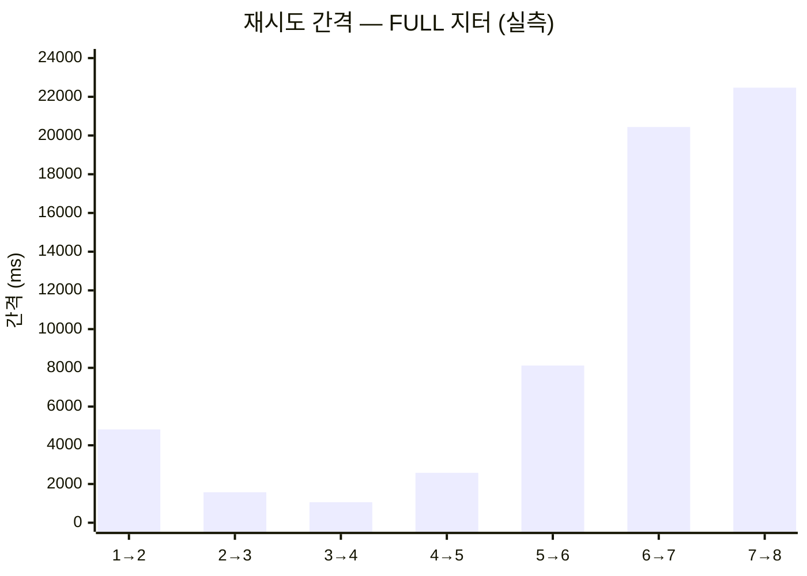
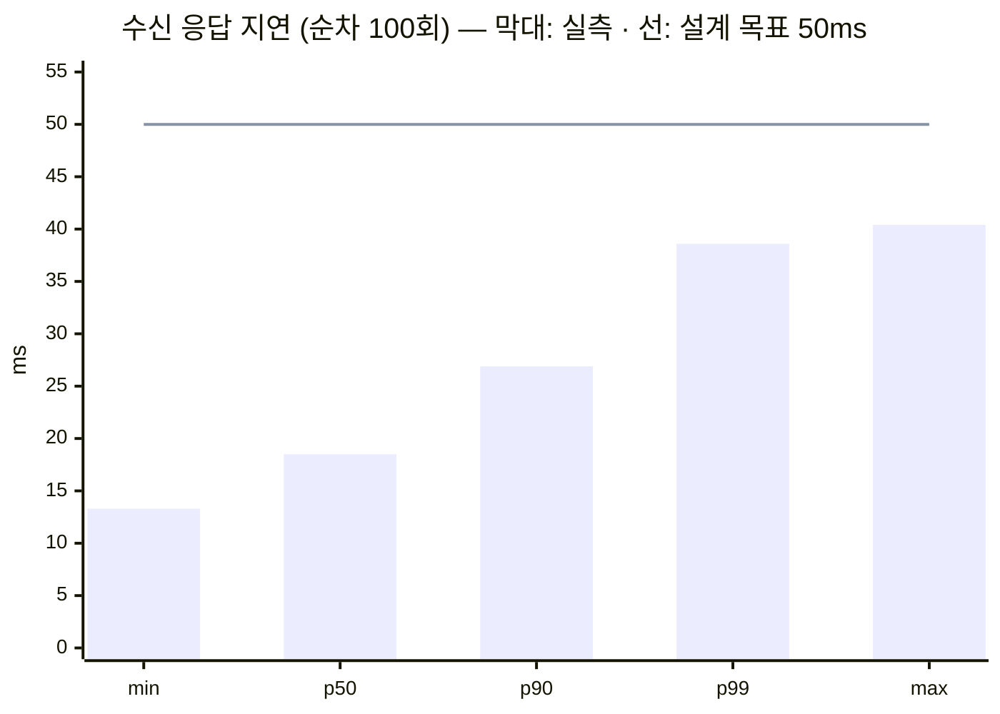

# 2차 작업 — 통합 검증 결과

**작업일**: 2026-09-09
**대상**: 게이트웨이 `4584b93` + 소비자 `cc413e3` + 루트 compose 스택
**관련 문서**: [구현 기록](2026-09-09_02_통합_구현기록.md), [남은 과제](2026-09-09_02_통합_남은과제.md)

---

## 1. 검증 환경

1차와 결정적으로 다른 점은 **소비자가 목이 아니라 진짜라는 것**이다.
목 소비자는 "5xx 를 뱉어라"고 시킬 수 있었지만, 진짜 소비자는 **자기 도메인 규칙에 따라**
응답 코드를 정한다. 잔액이 부족하면 422 가 나오는 것이지 내가 시켜서 나오는 것이 아니다.

| 구성 | 정체 |
| --- | --- |
| 제공자 | 서명 붙여 POST 쏘는 셸 (`000_Infra/tools/e2e.sh`, 시나리오 스크립트) |
| 게이트웨이 | `wg-gateway` 컨테이너 :8080 |
| 소비자 | `wg-service` 컨테이너 :8081 — **결제 도메인을 가진 실제 서비스** |
| DB | `wg-mysql` 컨테이너, 스키마 2개 |

```
docker compose up -d      # 3개 컨테이너
000_Infra/tools/e2e.sh              # 정상 경로 1회
```

다운 시나리오는 `docker compose stop -t 1 service` 로 소비자를 실제로 죽여서 만들었다.

---

## 2. 자동화 테스트

```
001_WebhookGateway   ./gradlew test           →  31 tests, 실패 0, BUILD SUCCESSFUL in 54s
002_WebhookService   ./gradlew cleanTest test →  26 tests, 실패 0, BUILD SUCCESSFUL in 55s
```

| 프로젝트 | 클래스 | 개수 | 무엇을 지키는가 |
| --- | --- | --- | --- |
| 게이트웨이 | `SignatureVerifierTest` | 8 | 서명 검증의 세 논점 |
| | `BackoffCalculatorTest` | 5 | 백오프와 지터 3종 |
| | `ReceiveIntegrationTest` | 8 | 원본 보존과 중복 차단 |
| | `DispatchIntegrationTest` | 10 | 전달 판정과 좀비 회수 |
| 소비자 | `AccountTest` | 5 | 잔액 규칙 (경계값 포함) |
| | `PaymentServiceTest` | 5 | 결제 유스케이스, **페이로드 금액 무시** |
| | `WebhookReceiverTest` | 4 | 중복 제거, 중복 시 예외 없음 |
| | `WebhookControllerTest` | 6 | 응답 코드 매핑 |
| | `PaymentWebhookIntegrationTest` | 5 | MySQL 위에서 전 구간 |
| | `ServiceApplicationTests` | 1 | 컨텍스트 로딩 |

양쪽 통합 테스트 모두 Testcontainers MySQL 위에서 돈다. H2 로 대체할 수 없다 —
게이트웨이는 `FOR UPDATE SKIP LOCKED`(8.0 전용)와 유니크 인덱스가, 소비자는 PK 충돌 동작이
**검증 대상 그 자체**이기 때문이다.

---

## 3. 실측 시나리오

아래는 전부 실제로 돌린 결과 그대로다.

### 3.1 정상 경로 (`000_Infra/tools/e2e.sh`)

```
발사:  X-GitHub-Delivery: e2e-…  +  HMAC 서명
       → 200 {"eventId":4,"status":"accepted"}
원장:  status=DELIVERED  attempt_count=1
       delivery_attempt: attempt_no=1  response_status=200  outcome=DELIVERED  duration_ms=984
소비자: 잔액 5000 → 4000,  processed_event 1건
```

첫 전달의 `duration_ms` 가 984ms 인 것은 소비자 쪽 JIT 워밍업이다.
이후 시도들은 19ms · 49ms 로 떨어진다.

### 3.2 중복 차단 — 같은 이벤트 20건

```
발신 결과:   accepted=1  duplicate=19  기타=0
원장:        DELIVERED (1건)
소비자 잔액:  5000 → 4000
처리 기록:    1건
```

**소비자에게 간 것은 1건이다.** 유니크 인덱스가 19건을 삽입 단계에서 떨궜고,
제공자에게는 200 을 돌려줘 재시도를 멈추게 했다.

### 3.3 소비자 멱등성 — 3단 방어선 단독 검증

게이트웨이를 건너뛰고 **같은 `X-Gateway-Event-Id` 로 소비자에 직접 3회** POST 했다.

```
1회차 HTTP 200
2회차 HTTP 200
3회차 HTTP 200
소비자 잔액: 5000 → 4000
```

세 번 다 200 이고 결제는 한 번이다. 이것이 1차에서 확인할 수 없던 항목이다 —
목 소비자에는 멱등성이 없었으므로 3단 방어선 자체가 존재하지 않았다.

**중복에 200 을 주는 것이 왜 중요한지**도 여기서 드러난다. 4xx 를 줬다면 게이트웨이가
정상 처리된 건을 데드레터로 보냈을 것이다.

### 3.4 잔액 부족 — 422 → 즉시 DEAD

```
시드: 잔액 500, 주문 금액 1000
```

| id | status | attempt_count | attempt_no | response_status | outcome | duration_ms |
| --- | --- | --- | --- | --- | --- | --- |
| 25 | **DEAD** | 1 | 1 | **422** | DEAD | 46 |

```
소비자 잔액:  500 (그대로)
처리 기록:    0건
```

엔드포인트의 `maxAttempts` 가 8인데도 **한 번 만에 끝났다.** 재시도해도 잔액은 그대로이기 때문이다.

**처리 기록이 0건인 것이 핵심이다.** 기록과 결제가 한 트랜잭션이라 함께 롤백됐다.
나중에 충전하고 재생하면 이 이벤트는 다시 처리될 수 있다.

### 3.5 없는 주문 — 400 → 즉시 DEAD

| id | status | attempt_count | attempt_no | response_status | outcome | duration_ms |
| --- | --- | --- | --- | --- | --- | --- |
| 26 | **DEAD** | 1 | 1 | **400** | DEAD | 18 |

처리 기록 0건. 3.4 와 같은 이유다.

### 3.6 거부 경로

| 요청 | 응답 |
| --- | --- |
| 위조 서명 (`sha256=0000…`) | **401** |
| 서명 헤더 자체가 없음 | **401** |
| 없는 엔드포인트 (`/webhooks/nope`) | **404** |
| 소비자에 `X-Gateway-Event-Id` 없이 | **400** |
| 소비자에 `orderId` 없이 | **400** |

401 응답 본문에는 실패 사유가 없다. 사유는 게이트웨이 로그에만 남는다.

### 3.7 소비자 40초 다운 → 재시도 → 복구

**이번 검증에서 가장 많은 것을 알려준 시나리오다.**

```
docker compose stop -t 1 service
→ 웹훅 발사 (eventId=27)
→ 40초 대기
→ docker compose start service
```

| 시도 | 시각 | 응답 | 결과 | 직전 시도와의 간격 |
| --- | --- | --- | --- | --- |
| 1 | 05:44:01.960 | ConnectException | RETRY | — |
| 2 | 05:44:06.779 | ConnectException | RETRY | 4,819ms |
| 3 | 05:44:08.353 | ConnectException | RETRY | 1,574ms |
| 4 | 05:44:09.414 | ConnectException | RETRY | 1,061ms |
| 5 | 05:44:11.993 | ConnectException | RETRY | 2,579ms |
| 6 | 05:44:20.113 | ConnectException | RETRY | 8,120ms |
| 7 | 05:44:40.553 | ConnectException | RETRY | 20,440ms |
| 8 | 05:45:03.026 | **200** | **DELIVERED** | 22,473ms |

```
최종:        status=DELIVERED  attempt_count=8
소비자 잔액:  5000 → 4000   (재시도 7번 끝에 정확히 1회 결제)
```

```
0s        10s       20s       30s       40s       50s       60s
├─────────┼─────────┼─────────┼─────────┼─────────┼─────────┤
①  ②③④   ⑤        ⑥                   ⑦                   ⑧
                                           ▲                ▲
                                    소비자 재기동(~41s)   DELIVERED
```



**지터가 작동한 증거는 간격이 단조증가하지 않는다는 것이다.** 3번 간격(1,061ms)이
2번 간격(1,574ms)보다 작다. 지수 백오프의 base 는 1s → 2s → 4s … 로 자라지만
`FULL` 지터가 각 구간에서 `random(0, base)` 를 뽑기 때문이다.

#### 여기서 나온 문제 — `max_attempts=8` 이 40초 다운을 겨우 버텼다

**8번째 시도에서 성공했다.** 한 번만 더 실패했으면 `DEAD` 였다.

총 소요는 61.1초(05:44:01.960 → 05:45:03.026)다. 이것은 우연이 아니라 계산된 값에 가깝다.

| | 8회로 커버되는 시간 |
| --- | --- |
| 지터 없음 (`NONE`) | 1+2+4+8+16+32+64 = **127초** |
| `FULL` 지터 기댓값 | 각 구간이 `random(0, base)` 이므로 **약 63.5초** |
| **실측** | **61.1초** |

`FULL` 지터는 복구 시각을 흩어 thundering herd 를 막는 대신, **같은 시도 횟수로 커버할 수
있는 다운타임을 절반으로 줄인다.** 백오프 상한이 1시간이어도 그 근처에 가보지도 못하고
시도가 소진된다.

즉 지금 설정은 **소비자가 1분 넘게 다운되면 이벤트가 데드레터로 간다.**
게이트웨이를 만든 이유가 "소비자 사정이 잠깐 나쁠 때 대신 붙들고 있는 것"인데,
그 '잠깐'이 1분이라는 뜻이다. 남은 과제 2.1 에서 다룬다.

#### 부수 관찰

- `duration_ms` 가 시도마다 갈린다: **3,746 / 2 / 2 / 1 / 3 / 3,725 / 3,729ms**.
  즉시 커넥션 거부(1~3ms)와 연결 타임아웃(≈3.7초, `connect-timeout: 3s`)이 섞였다.
  컨테이너 정지 직후 도커 네트워크 상태에 따라 갈리는 것으로 보이는데 **단정할 수 없다.**
  실제로 중요한 것은 타임아웃이 걸린 시도가 그만큼 워커를 붙잡는다는 점이다.

- `event.last_backoff_ms` 는 컬럼이 하나라 **시도별 백오프 이력이 남지 않는다.**
  조회하면 항상 마지막 값 하나뿐이고, 각 시도가 얼마를 기다렸는지는
  `delivery_attempt.started_at` 의 차이로 역산해야 한다. 위 표의 간격이 그렇게 구한 값이다.

### 3.8 수신 응답 지연 — 1차가 "미측정"으로 남긴 항목

서로 다른 이벤트로 순차 100회 발사했다.

| | ms |
| --- | --- |
| min | 13.3 |
| **p50** | **18.5** |
| p90 | 26.9 |
| **p99** | **38.6** |
| max | 40.4 |



**설계 6.4 의 목표 p99 50ms 를 만족한다.**

다만 이 숫자를 과신하면 안 된다.

| 이 측정의 한계 | |
| --- | --- |
| 순차 100회다 | 동시 요청이 없다. **부하 상황이 아니다** |
| `curl` 왕복 기준이다 | 프로세스 기동과 커넥션 수립이 포함된다. 서버 처리 시간만이 아니다 |
| 표본이 100개다 | p99 를 말하기엔 얇다. 사실상 상위 1~2개 값이다 |
| 로컬 도커다 | 네트워크 지연이 사실상 0 이다 |

**부하 도구(k6 등)로 다시 재야 한다.** 이 값은 "구조적으로 느리지는 않다" 정도의 근거다.

전달도 전부 소진됐다.

```
100건 발사 → 남은 미전달 0
소비자 처리 기록 100건   (전부 도달, 중복 0)
```

### 3.9 소비자를 우회 호출하면 어떻게 되는가

```
서명 없이 http://localhost:8081/webhook/receiver 로 직접 POST
  → HTTP 200
  → 소비자 잔액 5000 → 4000
```

**서명 없이 결제가 됐다.** 이것은 버그가 아니라 지금 구조가 그렇게 되어 있는 것이고,
가장 크게 벌어진 구멍이다. 남은 과제 1절에서 다룬다.

---

## 4. 시나리오와 방어선 대응표

| 시나리오 | 무엇이 막았나 | 결과 |
| --- | --- | --- |
| 3.2 제공자 20건 재시도 | 1단 — `uk_event_idem` | 소비자 도달 1건 |
| 3.3 같은 이벤트 직접 3회 | 3단 — `processed_event` PK | 결제 1회 |
| 3.7 40초 다운 후 8회 시도 | 1·3단 모두 | 결제 1회 |
| 3.8 100건 동시 유입 | — | 100건 도달, 중복 0 |

2단(`SKIP LOCKED`)은 실측으로 직접 보이지 않는다. 워커가 8개인데 이벤트가 적어
경합이 일어나지 않기 때문이다. `DispatchIntegrationTest` 가 이것을 검증한다.

---

## 5. 아직 측정하지 않은 것

| 항목 | 상태 | 왜 필요한가 |
| --- | --- | --- |
| 부하 상황의 수신 지연 | **미측정** | 3.8 은 순차 측정이다. 동시 요청에서의 p99 가 진짜 숫자다 |
| 워커 수별 폴링 부하와 락 경합 | **미측정** | **DB 큐 → 브로커 전환 기준이 여기서 나온다** (설계 10.1) |
| `idx_event_dispatch` 실제 잠금 범위 | **미측정** | `SKIP LOCKED` 가 갭 락 때문에 넓게 잠그는지 (설계 10.2) |
| 지터 3종 복구 곡선 비교 | **부분** | `FULL` 만 쟀다(3.7). `DECORRELATED` 와 비교해야 3.7 의 결론이 확정된다 |
| 페이로드 크기별 지연 | **미측정** | 오브젝트 스토리지 분리 임계값 (설계 13) |
| 좀비 회수 실측 | **테스트만** | 전달 도중 게이트웨이를 죽이는 재현이 까다롭다. `DispatchIntegrationTest` 로 커버 |
| 소비자 동시 중복 요청 | **미측정** | 같은 이벤트를 동시에 쏴서 PK 충돌 경로를 실제로 타는지. 남은 과제 1.2 와 직결 |

마지막 항목이 새로 생긴 것이다. 지금 소비자의 중복 방어는 **DB 격리 수준에 의존하는데**
그 경로를 실제로 밟아보지 않았다.

---

## 6. 결론

**이번에 새로 확인된 것**

| | |
| --- | --- |
| 3단 방어선이 실제로 작동한다 | 3.3 — 게이트웨이 없이도 소비자가 중복을 막는다 |
| 실패 판정이 도메인에서 나온다 | 3.4, 3.5 — 잔액 부족 422, 없는 주문 400 이 즉시 DEAD 로 이어진다 |
| 롤백이 재생 가능성을 남긴다 | 3.4 — 실패한 이벤트는 처리 기록을 남기지 않는다 |
| 수신 지연이 목표 안에 있다 | 3.8 — p99 38.6ms (조건부) |

**이번에 새로 드러난 문제**

| | |
| --- | --- |
| `max_attempts=8` + `FULL` 지터로는 1분 다운도 아슬아슬하다 | 3.7 — 8회를 다 쓰고 겨우 성공 |
| 소비자가 서명을 검증하지 않는다 | 3.9 — 서명 없이 결제가 된다 |
| 시도별 백오프 이력이 남지 않는다 | 3.7 — `last_backoff_ms` 컬럼이 하나뿐 |

**여전히 못 막은 것** (설계 14절, 1차 문서와 동일)

- **FM-2 (배포 중 유실)** — 게이트웨이 자신이 단일 장애점이다
- **FM-4 (순서 역전)** — 설계 12.2 가 의도적으로 제외했다
- **FM-6 (재생)** — 원본은 쌓이는데 흘릴 수단이 없다

---

## 7. 재현 방법

```bash
docker compose up -d --build
000_Infra/tools/e2e.sh                       # 3.1
```

나머지 시나리오는 아래 요령이다.

```bash
# 3.2 중복 차단 — 같은 X-GitHub-Delivery 로 반복 발사
# 3.3 소비자 멱등성 — 게이트웨이를 건너뛰고 직접 POST
curl -X POST localhost:8081/webhook/receiver \
  -H 'Content-Type: application/json' -H 'X-Gateway-Event-Id: same-id' \
  -d '{"orderId":123,"amount":1000}'

# 3.4 잔액 부족 — 잔액을 주문 금액보다 작게 시드하고 발사
# 3.7 다운 → 복구
docker compose stop -t 1 service
#   … 웹훅 발사 후 대기 …
docker compose start service
```

시나리오 스크립트 원본은 세션 스크래치패드에 있고 저장소에 커밋되지 않았다.
**`tools/` 에 넣는 것이 남은 과제 3절이다.**
