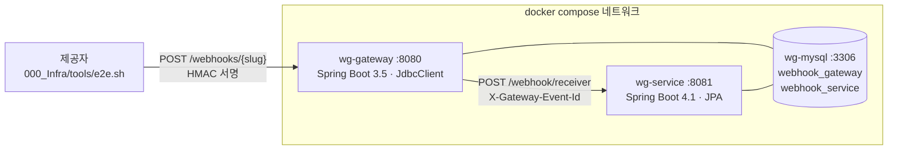
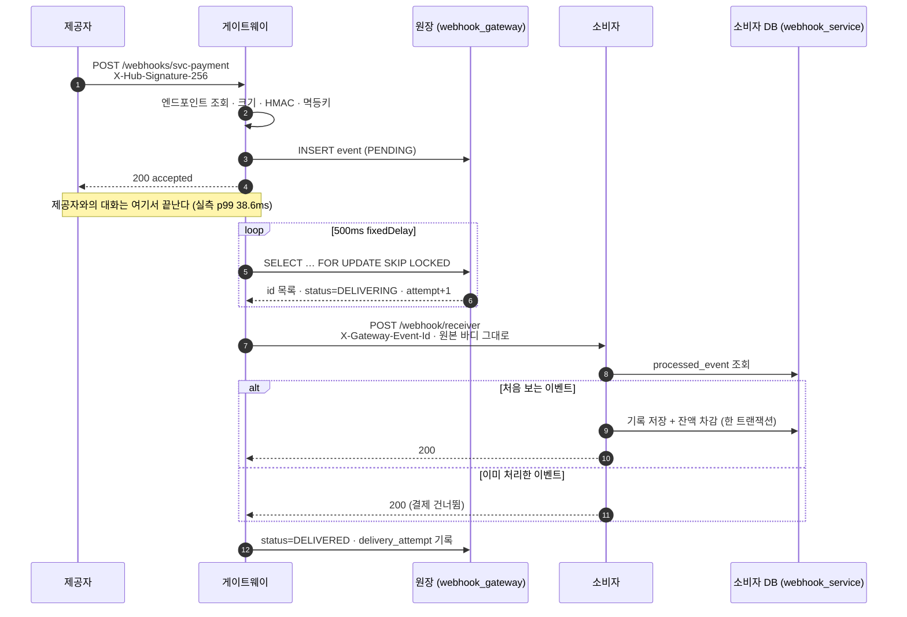
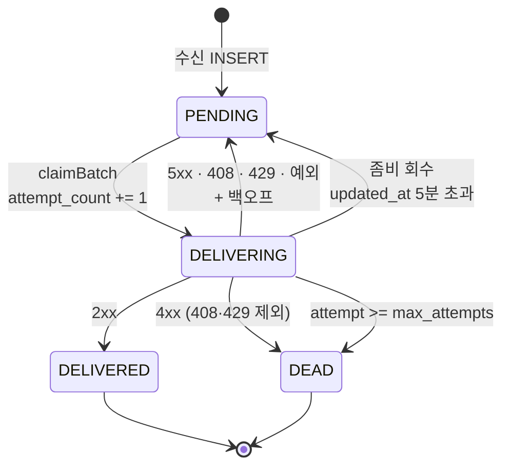
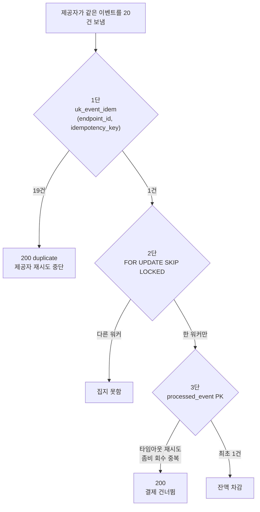

# 2차 작업 — 게이트웨이·소비자 통합 구현 기록

**작업일**: 2026-09-09
**대상**
- 게이트웨이 `001_WebhookGateway` @ `4584b93` (+ 미커밋 `Dockerfile`, `.dockerignore`)
- 소비자 `002_WebhookService` @ `cc413e3`
- 통합 스택 루트 `compose.yaml`, `docker/`, `000_Infra/tools/e2e.sh` (버전 관리 밖)

**기준 문서**: [설계](../001_WebhookGateway/webhook-gateway-design.md), [1차 구현 기록](../001_WebhookGateway/docs/2026-09-04_01_mvp_구현기록.md)

---

## 1. 이번에 만든 것

1차(2026-09-04)는 **게이트웨이 한 박스**였다. 소비자는 응답 코드를 마음대로 바꾸는
목 서버(`000_Infra/tools/MockConsumer.java`)였고, 검증 구성은 폐쇄 루프였다.

이번에 소비자를 **실제 도메인을 가진 별도 애플리케이션**으로 만들고 둘을 compose 로 묶었다.
게이트웨이가 "소비자가 멱등해야 한다"고 계속 말해온 그 멱등성을, 이번엔 소비자 쪽에서 구현했다.

| | 1차 (2026-09-04) | 2차 (2026-09-09) |
| --- | --- | --- |
| 소비자 | 목 서버 | `002_WebhookService` — 계좌·주문·결제 |
| 실행 | `bootRun` + 목 서버 수동 기동 | `docker compose up -d` 한 번 |
| DB | `webhook_gateway` 하나 | 한 인스턴스에 `webhook_gateway` / `webhook_service` |
| 전 구간 확인 | 수동 curl 조합 | `000_Infra/tools/e2e.sh` |
| 중복 방어 | 2단 (유니크 인덱스 + SKIP LOCKED) | **3단** (+ 소비자 `processed_event`) |

게이트웨이 코드는 서명 검증기를 `receive/signature` 하위 패키지로 분리한 것 외에
기능 변경이 없다. **이 문서가 새로 적는 것은 소비자 로직과 두 서비스 사이의 계약이다.**

---

## 2. 결과물 구조



```
D:\1_Github\402_WebhookGateway
├─ compose.yaml            mysql + gateway + service
├─ 000_Infra/docker/mysql-init.sql   두 스키마 생성 (볼륨이 빌 때 1회)
├─ 000_Infra/tools/e2e.sh            시드 → 등록 → 발사 → 결과 확인
├─ 001_WebhookGateway/     게이트웨이 (별도 git 저장소)
└─ 002_WebhookService/     소비자 (별도 git 저장소)
```

### 소비자 패키지

| 패키지 | 역할 |
| --- | --- |
| `webhook` | 수신 엔드포인트, 중복 제거, 예외 → 응답 코드 매핑 |
| `payment.application` | 결제 유스케이스 |
| `payment.domain` | `Account` · `Order` 애그리거트와 잔액 규칙 |

| 타입 | 무엇인가 |
| --- | --- |
| `WebhookController` | `/webhook/receiver`. 헤더를 받고 리시버로 넘기는 것이 전부 |
| `WebhookReceiver` | **중복 제거 지점.** `processed_event` 조회 → 기록 → 결제 |
| `WebhookExceptionHandler` | 예외를 게이트웨이가 알아들을 응답 코드로 번역 |
| `ProcessedEvent` | 3단 방어선. PK 가 `gateway_event_id` |
| `Account#withdraw` | 잔액 규칙이 사는 유일한 곳 |

목 소비자는 없어지지 않았다. 게이트웨이 단독 실험에는 여전히 `MockConsumer` 를 쓴다.
compose 스택은 **전 구간이 실제로 이어지는지** 보는 용도다.

---

## 3. 웹훅 한 건이 실제로 어떻게 흐르는가



핵심은 **4번과 5번 사이의 시간축 분리**다. 제공자는 4번까지만 기다린다.
소비자가 느리든 죽어 있든 제공자가 보는 응답 시간은 변하지 않는다 — 설계가 FM-1 로 부른 실패 모드다.

---

## 4. 게이트웨이 쪽 요약

1차 문서에 자세히 있다. 소비자와의 계약을 이해하는 데 필요한 만큼만 다시 적는다.

### 4.1 수신 판정

응답 코드는 전부 하나의 질문으로 결정된다. **"제공자가 다시 보내게 할 것인가."**

| 검사 | 실패 시 | 왜 |
| --- | --- | --- |
| slug 조회 · `enabled` | **404** | 없는 주소다 |
| 바디 ≤ 1MB | **413** | 같은 크기로 다시 와도 같다 |
| 검증기 존재 | **500** | 우리 설정 오류다. 재시도를 받는 편이 유실보다 낫다 |
| HMAC 서명 | **401** | 다시 와도 틀리다. **사유는 응답에 담지 않는다** |
| `INSERT event` | **200 duplicate** | 유니크 위반 = 이미 받았다. 200 이어야 제공자 재시도가 멈춘다 |

바디를 `byte[]` 로 받는 이유는 재직렬화하면 HMAC 이 원천적으로 깨지기 때문이다.
DB 쓰기는 이 경로에 정확히 한 번뿐이다.

### 4.2 원장 상태 기계



`attempt_count` 는 **집는 순간** 올린다. 그래서 프로세스가 죽어 회수된 건도 시도 한 번을
소진한다. `max_attempts` 는 "성공한 시도"가 아니라 **"시작한 시도"의 상한**이다.
첫 전달이 나갈 때 `X-Gateway-Attempt` 는 이미 `1` 이다.

### 4.3 전달 판정

```java
boolean permanent = status >= 400 && status < 500 && status != 408 && status != 429;
```

| 소비자 응답 | 판정 |
| --- | --- |
| 2xx | `DELIVERED` |
| 400 · 404 · 422 … | `DEAD` **즉시** (`max_attempts` 무시) |
| **408 · 429** | 재시도 — "지금은 안 된다"는 뜻이라 설계의 `4xx → DEAD` 에서 뺐다 |
| 5xx · 커넥션 거부 · 타임아웃 | 재시도 |

---

## 5. 소비자 로직 — 이번에 새로 만든 것

### 5.1 수신과 중복 제거

```
POST /webhook/receiver
  ├─ X-Gateway-Event-Id      필수. 없으면 400
  ├─ X-Gateway-Endpoint      선택. 로깅용
  ├─ X-Gateway-Attempt       선택, 기본 0. 로깅용
  └─ body {orderId, amount}  orderId 는 @NotNull
        │
        ▼
  WebhookReceiver.receivePaymentDelivery()   @Transactional
        ├─ processed_event 에 이 eventId 가 있는가?
        │     └─ 있다 → 아무것도 하지 않고 반환 → 200
        ├─ processed_event 저장
        └─ PaymentService.processPayment(orderId)
```

**중복일 때 예외를 던지지 않는 것이 핵심이다.**

| 중복에 무엇을 돌려주면 | 게이트웨이가 하는 일 |
| --- | --- |
| 4xx | 데드레터로 보낸다 — **정상 처리한 건이 DEAD 가 된다** |
| 5xx | `max_attempts` 까지 계속 때린다 |
| **200** | 재시도가 멈춘다 ✅ |

**기록과 결제가 한 트랜잭션인 것도 핵심이다.** `@Transactional` 이 없으면 결제가 실패해도
처리 기록만 남고, 재시도가 그 기록에 걸려 중복으로 스킵되면서 **결제가 영영 유실된다.**

이 성질 덕분에 잔액 부족(422)이나 없는 주문(400)은 롤백되어 `processed_event` 에
아무것도 남지 않는다. 나중에 충전하고 재생하면 다시 처리할 수 있다 — 실측으로 확인했다.

### 5.2 응답 코드 = 게이트웨이에 대한 지시

기준은 하나다. **"똑같은 요청을 다시 보내면 성공할 가능성이 있는가."**

| 상황 | 예외 | 응답 | 게이트웨이 판정 |
| --- | --- | --- | --- |
| 정상 · 중복 | — | **200** | `DELIVERED` |
| 없는 주문 | `OrderNotFoundException` | **400** | `DEAD` 즉시 |
| 없는 계좌 | `AccountNotFoundException` | **400** | `DEAD` 즉시 |
| 잔액 부족 | `InsufficientBalanceException` | **422** | `DEAD` 즉시 |
| 이벤트 ID 헤더 누락 | (Spring) | **400** | `DEAD` 즉시 |
| `orderId` 누락 | (Bean Validation) | **400** | `DEAD` 즉시 |
| 그 밖 | — | **500** | 재시도 → 소진 시 `DEAD` |

이 판단을 뒤집으면 대가가 크다. 4xx 를 5xx 로 두면 영원히 실패할 요청을 계속 받고,
5xx 를 4xx 로 두면 살릴 수 있는 이벤트를 버린다.

### 5.3 결제 도메인

```
PaymentService.processPayment(orderId)     @Transactional
  ├─ Order 조회        없으면 OrderNotFoundException
  ├─ Account 조회      없으면 AccountNotFoundException
  ├─ account.withdraw(order.getAmount())
  │     ├─ amount <= 0      → IllegalArgumentException
  │     └─ balance < amount → InsufficientBalanceException
  └─ save
```

잔액 규칙은 전부 `Account` 애그리거트 안에만 있다. 서비스는 조회하고 도메인 메서드를
불러 결과를 저장할 뿐이다.

---

## 6. 두 서비스의 계약

### 게이트웨이가 붙이는 헤더

| 헤더 | 값 | 소비자가 쓰는가 |
| --- | --- | --- |
| `X-Gateway-Event-Id` | 원장의 `event.id` | **필수로 쓴다** — 중복 제거 키 |
| `X-Gateway-Endpoint` | endpoint slug | 로깅만 |
| `X-Gateway-Attempt` | 몇 번째 시도인가 (첫 전달이 1) | 로깅만 |
| `X-Gateway-Received-At` | 게이트웨이 수신 시각 | 안 쓴다 |
| `X-Gateway-Idempotency-Source` | `PROVIDER_ID` / `BODY_HASH` | 안 쓴다 |
| `X-Gateway-Replay` | 재생 이벤트인가 (현재 항상 `false`) | 안 쓴다 |

### 원본 헤더는 그대로 넘어간다 (PASSTHROUGH)

**화이트리스트가 아니라 최소 블록리스트**로 거른다. hop-by-hop, `Host`/`Content-Length`,
자격 증명(`Authorization`·`Cookie`), `X-Gateway-*` 만 뺀다.

화이트리스트를 못 쓰는 이유는 **무엇이 서명 헤더인지 제공자마다 다르고 미리 다 알 수 없기**
때문이다. 모르는 제공자의 서명 헤더를 실수로 떨어뜨리면 소비자 쪽 검증이 조용히 깨진다.

이 설계는 **소비자가 원 제공자의 서명을 재검증한다는 전제** 위에 서 있다.
지금 소비자는 그 검증을 하지 않는다 — [남은 과제](2026-09-09_02_통합_남은과제.md) 1절.

### 바디는 원본 바이트 그대로

게이트웨이는 페이로드를 파싱하지도 재직렬화하지도 않는다.

---

## 7. 중복이 걸러지는 3개 지점



| # | 어디 | 무엇으로 | 어떤 중복을 막나 |
| --- | --- | --- | --- |
| 1 | 게이트웨이 수신 | `uk_event_idem` | **제공자**의 재시도 |
| 2 | 게이트웨이 전달 | `FOR UPDATE SKIP LOCKED` | **워커 간** 중복 클레임 |
| 3 | 소비자 수신 | `processed_event` PK | **게이트웨이→소비자** 구간의 중복 |

3번이 없으면 나머지 둘이 아무리 완벽해도 결제가 두 번 일어난다. 2번을 통과한 뒤에도
중복이 생기는 경로가 남기 때문이다.

| 3번이 실제로 막는 상황 | |
| --- | --- |
| 소비자가 처리는 했는데 응답이 타임아웃 | 게이트웨이는 실패로 보고 재시도한다 |
| POST 후 응답 전에 게이트웨이가 죽음 | 좀비 회수가 5분 뒤 다시 보낸다 |
| 소비자가 200 을 줬는데 네트워크에서 유실 | 게이트웨이는 실패로 본다 |

**게이트웨이는 exactly-once 를 제공하지 않는다.** 분산 트랜잭션 없이는 불가능하고,
`at-least-once + 소비자 멱등성`이 유일한 실용적 해법이다. 3번은 선택이 아니라 필수다.

---

## 8. 이번에 정한 결정

### 8.1 잔액 부족을 422 로 둔다 — 갈릴 수 있는 판단

충전을 기대해 5xx 로 재시도를 받는 선택도 가능하다. 그러나 게이트웨이 백오프의 상한이
1시간이라 충전을 기다리기엔 짧고, 그동안 워커 하나를 붙잡는다.

결제 실패는 인프라 재시도가 아니라 **사용자에게 알려 해결할 일**이라고 보고 4xx 를 택했다.
`WebhookExceptionHandler` 에 근거를 주석으로 남겼다.

### 8.2 차감 금액은 페이로드가 아니라 DB 에서 읽는다

`PaymentEvent.amount` 는 받기만 하고 쓰지 않는다. `account.withdraw(order.getAmount())` 다.

웹훅 바디는 외부에서 온 값이라 금액의 출처가 되면 안 된다. 서명이 유효해도 마찬가지다 —
서명은 "제공자가 보냈다"를 증명할 뿐 "금액이 맞다"를 증명하지 않는다.
`PaymentServiceTest#usesStoredOrderAmount` 로 고정했다.

### 8.3 이벤트 ID 헤더가 없으면 받지 않는다

`X-Gateway-Event-Id` 를 `required = true` 로 뒀다. 없으면 400 이고 게이트웨이는 즉시 DEAD 로 보낸다.

중복 제거를 할 수 없는 요청을 받아 처리하면 **결제가 몇 번 일어날지 아무도 모른다.**
받아서 잘못 처리하는 것보다 거부하고 데드레터에 남기는 편이 낫다.

### 8.4 포트/어댑터를 두지 않고 Spring Data 인터페이스를 그대로 쓴다

도메인이 JPA 를 알게 되는 대신 클래스 수가 절반이 된다. 게이트웨이를 검증하기 위한
소비자라 이 정도 타협을 택했다. 진짜 결제 시스템이라면 다르게 갔을 것이다.

### 8.5 MySQL 은 한 인스턴스, 스키마만 나눈다

`000_Infra/docker/mysql-init.sql` 이 `webhook_gateway` 와 `webhook_service` 를 만든다.

두 서비스가 **논리적으로는 완전히 분리**되어 있다(FK 도 조인도 없다). 인스턴스를 나누면
검증 환경만 무거워진다. 실제 배포에서 갈라야 한다면 커넥션 문자열만 바꾸면 된다.

### 8.6 기타

| 결정 | 근거 |
| --- | --- |
| 멀티스테이지 Dockerfile | 의존성 해석과 소스 컴파일을 나눠 캐시를 살린다. 실행은 JRE 로 |
| Dockerfile 에서 `sed -i 's/\r$//' gradlew` | Windows 에서 만든 `gradlew` 가 CRLF 라 그대로 두면 컨테이너에서 `exec` 이 실패한다 |
| `targetUrl` 이 `http://service:8081` | 컨테이너 안에서 DB·소비자는 `localhost` 가 아니라 서비스 이름으로 해석된다 |
| 게이트웨이에만 healthcheck | 소비자에 actuator 의존성이 없다. 붙이는 것이 맞다 (남은 과제) |
| 소비자 테스트도 Testcontainers MySQL | 검증 대상이 PK 충돌 동작이라 H2 로 대체할 수 없다 |

---

## 9. 설계 문서와의 관계

| 설계 항목 | 이번 작업에서 |
| --- | --- |
| 7.6 "소비자가 `X-Gateway-Event-Id` 로 다시 걸러야 한다" | **구현했다.** 3단 방어선 |
| 9.5 PASSTHROUGH 의 전제 (소비자가 원 서명 재검증) | **아직 아니다.** 남은 과제 1절 |
| 12.2 순서 미보장 | 그대로. 소비자가 이벤트 시각으로 판정해야 한다 |
| 14절 exactly-once 미제공 | 그대로. 3단 방어선이 그 대가를 치르는 방식이다 |

---

## 10. 관련 문서

- [검증 결과](2026-09-09_02_통합_검증결과.md) — 실측 시나리오와 자동화 테스트
- [남은 과제](2026-09-09_02_통합_남은과제.md) — 확인된 구멍과 우선순위
- [1차 구현 기록](../001_WebhookGateway/docs/2026-09-04_01_mvp_구현기록.md) — 게이트웨이 내부 상세
