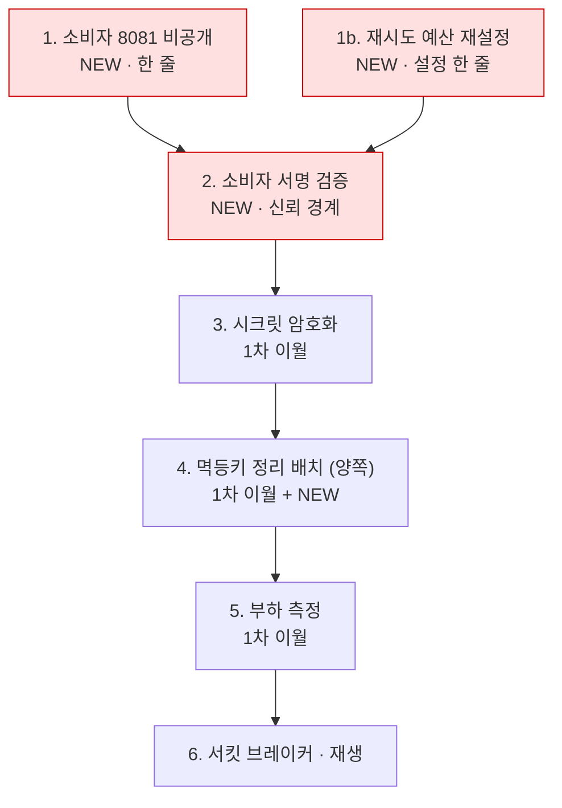
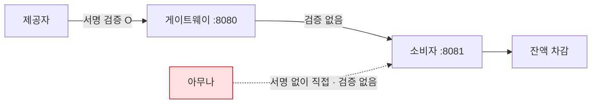

# 2차 작업 — 남은 과제

**작업일**: 2026-09-09
**기준**: 게이트웨이 `4584b93` + 소비자 `cc413e3` + 루트 compose 스택
**관련 문서**: [구현 기록](2026-09-09_02_통합_구현기록.md), [검증 결과](2026-09-09_02_통합_검증결과.md), [1차 남은 과제](../001_WebhookGateway/docs/2026-09-04_01_mvp_남은과제.md)

---

## 0. 우선순위

1차에서 넘어온 것과 이번에 새로 드러난 것이 섞여 있다. 새로 생긴 것에 **NEW** 를 붙였다.



| 순위 | 과제 | 왜 이 순서인가 |
| --- | --- | --- |
| 1 | **소비자 8081 을 비공개로** | 한 줄이고, 지금 가장 큰 구멍을 절반 막는다 |
| 1b | **재시도 예산 재설정** | 설정 한 줄. 지금 1분 다운에 이벤트를 잃는다 |
| 2 | **소비자 서명 검증 (또는 `resign`)** | 신뢰 경계를 세운다. 구멍의 나머지 절반 |
| 3 | 시크릿 암호화 | 2번에서 `resign` 을 택하면 선행 조건이 된다 |
| 4 | 멱등키 정리 배치 (게이트웨이 + **소비자**) | 안 하면 시간이 지날수록 반드시 나빠진다 |
| 5 | 부하 측정 | 설계가 "미측정"으로 남긴 판단들이 여기서 확정된다 |
| 6 | 서킷 브레이커 · 재생 | 5번의 결과가 임계값을 정해준다 |

---

## 1. 이번에 새로 드러난 것

### 1.1 소비자가 서명을 검증하지 않는다 — 가장 큰 구멍

**실측으로 확인했다** (검증 결과 3.9).

```
서명 없이 http://localhost:8081/webhook/receiver 로 직접 POST
  → HTTP 200,  잔액 5000 → 4000
```

`002_WebhookService` 어디에도 HMAC·서명·시크릿 관련 코드가 없다.
`X-Gateway-Event-Id` 헤더와 `orderId` 만 있으면 **누구의 요청이든 결제한다.**

이것이 왜 문제인지는 게이트웨이 쪽 주석이 이미 말하고 있다. PASSTHROUGH 모드로 원본 서명
헤더를 그대로 넘기는 이유는 **"소비자가 그 헤더로 원 제공자의 서명을 재검증하기 때문"** 이다.
그 전제가 성립하지 않는다. 지금은 신뢰 경계가 아예 없다.

`compose.yaml` 이 8081 을 호스트에 노출하는 것이 이 구멍을 실제로 도달 가능하게 만든다.



| 선택지 | 내용 | 비용 |
| --- | --- | --- |
| **C. 포트 비공개** | compose 에서 8081 을 `expose` 로만 두고 `ports` 를 뺀다 | 한 줄. **지금 당장** |
| A. 소비자가 원 서명 재검증 | `X-Hub-Signature-256` 을 자기 시크릿으로 검증 | 소비자에 시크릿 관리가 생긴다 |
| B. 게이트웨이가 재서명 (`resign`) | 소비자는 게이트웨이만 믿는다 | 재생과 한 묶음. 시크릿 암호화가 선행 |

C 는 방어가 아니라 **노출 축소**다. 그것만으로 끝내면 안 된다 —
같은 네트워크 안이면 여전히 아무나 부를 수 있다. C 를 먼저 하고 A 나 B 를 해야 한다.

**B 를 택하면 신뢰 경계가 이동한다.** 소비자는 이제 GitHub 을 믿는 것이 아니라 게이트웨이를
믿는다. 그래서 게이트웨이의 시크릿 관리 책임이 커지고, 3절(시크릿 암호화)이 선행 조건이 된다.

### 1.2 소비자 중복 방어가 DB 격리 수준에 의존한다

`ProcessedEvent` 는 `@Id` 가 애플리케이션이 채우는 String 이다. Spring Data JPA 의 `save()` 는
`isNew()`(= id 가 null 인가)로 분기하므로 **`persist` 가 아니라 `merge` 로 돈다** —
SELECT 한 번 후 INSERT 또는 UPDATE.

MySQL 기본값인 REPEATABLE READ 에서는 안전하다.

```
tx1: existsById → 없음        tx2: existsById → 없음
tx1: merge → SELECT 없음 → INSERT
tx2: merge → SELECT 없음(스냅샷) → INSERT → duplicate key → 롤백 → 500
게이트웨이 재시도 → existsById 에 걸림 → 200
결과: 결제 1회 ✅
```

**READ COMMITTED 로 바꾸면 깨진다.**

```
tx2: merge 의 SELECT 가 방금 커밋된 행을 본다 → UPDATE → 성공
     → processPayment 가 그대로 실행 → 중복 결제 ❌
```

지금 당장 문제는 아니지만 **안전성의 근거가 코드가 아니라 DB 설정에 있다.**
`Persistable<String>` 을 구현해 `isNew()` 를 `true` 로 고정하거나 네이티브 INSERT 로 바꾸면
격리 수준과 무관해진다.

> 코드를 읽고 추론한 것이다. 동시 요청으로 이 경로를 실제로 밟아보지 않았다 —
> 검증 결과 5절의 마지막 항목이다. **고치기 전에 재현 테스트부터 쓰는 것이 순서다.**

### 1.3 재시도 예산이 1분짜리다

검증 결과 3.7 에서 나온 것이다. **소비자 40초 다운에 8회 시도 중 8회를 다 썼다.**

| | 8회로 커버되는 시간 |
| --- | --- |
| `NONE` 지터 | 127초 |
| `FULL` 지터 기댓값 | 약 63.5초 |
| 실측 | **61.1초** |

`FULL` 지터는 thundering herd 를 막는 대신 **같은 시도 횟수로 커버할 수 있는 다운타임을
절반으로 줄인다.** 백오프 상한이 1시간이어도 근처에 가보지 못하고 소진된다.

즉 **소비자가 1분 넘게 다운되면 이벤트가 데드레터로 간다.** 게이트웨이를 만든 이유가
"소비자 사정이 잠깐 나쁠 때 대신 붙들고 있는 것"인데, 그 '잠깐'이 1분이라는 뜻이다.
배포 한 번에 이벤트가 다 죽는다.

해야 할 것 — 셋 중 하나가 아니라 조합이다.

| 방법 | 효과 | 대가 |
| --- | --- | --- |
| `max_attempts` 를 12~15 로 | 커버 시간이 지수적으로 는다 | 데드레터 진입이 늦어진다 |
| `jitter: DECORRELATED` | `random(initial, prev*3)` 이라 평균 대기가 더 길다 | 복구 곡선이 달라진다 — 비교 측정 필요 |
| `backoff.max` 를 낮춘다 (예: 5m) | 후반 시도가 촘촘해진다 | 소비자 압력이 는다 |

**어느 조합이 맞는지는 지터 3종 복구 곡선을 비교해야 정해진다.** 설계 11.2 가 요구했고
1차에서도 미룬 그 측정이다. 다만 **지금 값이 명백히 짧다는 것은 이미 실측으로 나왔으므로**,
측정 전이라도 `max_attempts` 를 올려두는 편이 낫다.

### 1.4 `X-Gateway-Event-Id` 가 게이트웨이 auto_increment 다

소비자의 중복 제거 키가 **게이트웨이 DB 의 `event.id`** 다. 게이트웨이 DB 를 초기화하면
(`docker compose down -v`) id 가 1부터 다시 시작하는데, 소비자의 `processed_event` 가
남아 있으면 **새 이벤트가 중복으로 오인되어 조용히 스킵된다.** 로그는 `debug` 라 보이지도 않는다.

`000_Infra/tools/e2e.sh` 가 매번 `DELETE FROM processed_event` 를 하는 것이 사실상 이 문제의 우회다.

게이트웨이가 UUID 를 함께 발급해 그것을 이벤트 ID 로 쓰면 사라진다.
`event` 에 `public_id CHAR(36)` 를 추가하는 정도다.

### 1.5 시도별 백오프 이력이 남지 않는다

`event.last_backoff_ms` 는 컬럼이 하나라 항상 마지막 값만 있다. 각 시도가 얼마를 기다렸는지는
`delivery_attempt.started_at` 차이로 역산해야 한다.

지터 3종을 비교하려면(1.3, 5절) **시도별 대기 시간이 그대로 남아야 한다.**
`delivery_attempt` 에 `backoff_ms` 컬럼을 추가하는 것이 맞다. 지금은 측정 자체가 번거롭다.

### 1.6 소비자에도 정리 배치가 없다

`processed_event` 는 무한히 쌓인다. 게이트웨이의 멱등키 정리 배치와 **같은 문제**이고,
1차 문서가 유일하게 "나중에 붙이면 이미 문제가 된 뒤"라고 못 박은 항목이다.

게이트웨이 쪽을 만들 때 소비자 쪽도 같이 만드는 것이 맞다.
다만 보관 기간의 근거가 다르다.

| | 보관 기간의 근거 |
| --- | --- |
| 게이트웨이 `event` | 제공자의 재시도 윈도우 |
| 소비자 `processed_event` | **게이트웨이의 재시도 윈도우** = `max_attempts` × 백오프 상한 |

1.3 에서 `max_attempts` 를 올리면 이 값도 같이 늘어야 한다. 짧게 잡으면
아직 재시도 중인 이벤트의 기록이 지워져 중복 결제가 난다.

---

## 2. 1차에서 그대로 넘어온 것

넷 다 손대지 않았다. 자세한 내용은 [1차 남은 과제](../001_WebhookGateway/docs/2026-09-04_01_mvp_남은과제.md) 참고.

| | 항목 | 상태 |
| --- | --- | --- |
| 2.1 | **멱등키 정리 배치** | `retention_days` 컬럼만 있고 지우는 코드가 없다. 이제 소비자 쪽도 필요하다(1.6) |
| 2.2 | **시크릿 평문 저장** | `secret_current VARBINARY` 에 원문 그대로. 1.1 에서 B 를 택하면 선행 조건 |
| 2.3 | **데드레터 알림 부재** | `log.error` 한 줄뿐. **이번 검증에서 DEAD 2건이 생겼는데 아무도 모른다** |
| 2.4 | **재생 미구현** | 원본은 쌓이는데 흘릴 수단이 없다. FM-6 이 안 막혔다 |

2.3 은 이번에 체감됐다. 검증 시나리오를 돌리는 것만으로 데드레터가 2건 생겼고,
`GET /admin/stats` 를 직접 치지 않으면 알 방법이 없었다.

2.4 는 1.1 의 B 안과 묶여 있다. `PASSTHROUGH` 로는 재생이 불가능하다 —
원본 서명 헤더를 그대로 보내면 타임스탬프 윈도우 때문에 소비자 검증이 무조건 실패한다.

---

## 3. 통합 스택 자체의 문제

| | 내용 | 조치 |
| --- | --- | --- |
| 루트 자산이 버전 관리 밖이다 | `compose.yaml`, `docker/`, `000_Infra/tools/e2e.sh`, 이 문서들이 어느 저장소에도 없다 | 루트를 `git init` 하거나 게이트웨이 저장소로 옮긴다 |
| 게이트웨이 `Dockerfile` 이 미커밋 | `001_WebhookGateway` 에 `??` 로 남아 있다 (소비자 쪽은 커밋됨) | 커밋 |
| 검증 시나리오가 스크립트로 안 남았다 | 이번 실측을 재현하려면 스크래치패드의 스크립트가 필요한데 저장소에 없다 | `tools/scenarios.sh` 로 커밋 |
| 소비자에 healthcheck 가 없다 | actuator 의존성이 없어 compose 가 기동 완료를 모른다 | actuator 추가 + healthcheck |
| Spring Boot 버전이 다르다 | 게이트웨이 3.5.0 / 소비자 4.1.1 | 지금은 무해. 공통 라이브러리를 쓰기 시작하면 맞춰야 한다 |
| e2e 시드가 도메인 불변식을 우회한다 | `INSERT INTO orders` 직접 실행이라 `amount > 0` 검사를 안 탄다 | 인지만. 시드는 원래 그런 것 |

세 번째 항목이 특히 아쉽다. **이번 검증 결과 문서의 숫자를 재현할 수단이 저장소에 없다.**

---

## 4. 측정으로 정해질 것

설계와 1차 문서가 "미측정"으로 남긴 판단들이고, 이번에 일부만 채웠다.

| 측정 | 무엇이 결정되나 | 상태 |
| --- | --- | --- |
| 수신 지연 p50/p99 | 목표 p99 50ms 달성 여부 | **부분 완료** — 순차 100회로 38.6ms. 부하 측정 필요 |
| 지터 3종 복구 곡선 | 기본 지터와 `max_attempts` (1.3) | **`FULL` 만 측정** |
| 워커 수별 폴링 부하와 락 경합 | **DB 큐 → 브로커 전환 기준** | 미측정 |
| `idx_event_dispatch` 잠금 범위 | `SKIP LOCKED` 가 갭 락으로 넓게 잠그는지 | 미측정 |
| 페이로드 크기별 지연 | 오브젝트 스토리지 분리 임계값 | 미측정 |
| 소비자 동시 중복 요청 | **1.2 의 안전성** | 미측정 |

마지막 항목이 이번에 새로 생겼다. 나머지는 설계 10.2 가 적은 그대로다.

> `idx_event_dispatch` 가 실제로 잠금 범위를 좁히는지 실행 계획으로 확인해야 한다.
> **이 부분은 실측 전까지 불확실하다.**

아직 불확실한 채다.

---

## 5. 해결이 아니라 인지해야 하는 것

구현으로 없앨 수 없는 것들이다. 없애려 하지 말고 문서와 소비자 가이드에 계속 남겨야 한다.

| 한계 | 왜 못 없애나 |
| --- | --- |
| exactly-once 를 제공하지 않는다 | 분산 트랜잭션 없이 불가능하다. `at-least-once + 소비자 멱등성`이 유일한 실용적 해법이다 |
| 순서를 보장하지 않는다 | 설계 12.2 의 의도적 제외. 소비자가 이벤트 시각으로 판정해야 한다 |
| 제공자 이벤트 ID 가 없으면 멱등성이 근사치다 | 바디 해시는 정상 중복 액션을 오판할 수 있다 |
| 재생은 소비자 멱등성 없이 안전하지 않다 | 부작용을 게이트웨이 단독으로 막을 수 없다 |
| **게이트웨이가 단일 장애점이다** | FM-2 를 풀려고 만든 물건이 같은 문제를 자기 자신에게 갖는다 |

마지막 항목은 인지로 끝나지 않고 **가용성 설계가 필요한 항목**이다.
전달부가 `SKIP LOCKED` 로 이미 다중 워커를 견디도록 되어 있어 **수평 확장 자체는 지금 구조에서
가능하다.** 검증은 4절의 폴링 부하 측정과 함께 해야 한다.

---

## 6. 요약

```
지금 당장:   소비자 8081 비공개 + max_attempts 상향  (둘 다 설정 한 줄)
그다음:      소비자 서명 검증 → 시크릿 암호화 → 정리 배치(양쪽)
측정 후:     지터/재시도 예산 확정 → 서킷 브레이커 → 재생
계속 남는 것: at-least-once, 순서 미보장, 게이트웨이 SPOF
```

**가장 먼저 할 것은 소비자 포트 비공개와 `max_attempts` 상향이다.**
둘 다 설정 한 줄인데, 하나는 서명 없이 결제되는 경로를 좁히고 하나는 1분 다운에
이벤트를 잃는 것을 막는다. **기능을 만들기 전에 이미 벌어져 있는 것부터 닫는 것이 순서다.**
